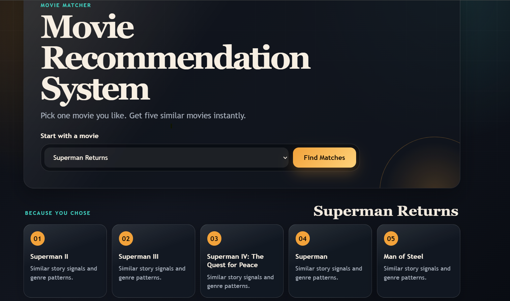

# 🎬 Movie Recommender System

A content-based movie recommendation system built with Python and Machine Learning. Enter a movie name and get 5 similar movie recommendations based on genres, keywords, cast, crew, and overview.

## 🚀 Demo



## 🧠 How It Works

The system uses a **content-based filtering** approach:

1. Movie metadata (genres, keywords, cast, crew, overview) is merged and cleaned
2. All features are combined into a single `tags` column
3. Text is vectorized using **Bag of Words** (CountVectorizer, 5000 features)
4. **Porter Stemming** reduces words to their root form
5. **Cosine Similarity** measures the closeness between movies in 5000-dimensional space
6. The top 5 most similar movies are returned as recommendations

## 🗂️ Project Structure
Movie-Recommender-System/
├── main.py                    # ML pipeline: data processing + model building
├── movies.csv                 # Movies dataset
├── credits.csv                # Cast & crew dataset
├── movie_recommender_web/     # Web app (HTML/CSS/Python)
└── .gitignore

## 🛠️ Tech Stack

- **Python** — Core language
- **Pandas** — Data manipulation
- **Scikit-learn** — CountVectorizer, Cosine Similarity
- **NLTK** — Porter Stemmer
- **Pickle** — Model serialization
- **HTML/CSS** — Frontend web interface

## ⚙️ Installation & Setup

1. **Clone the repository**
```bash
   git clone https://github.com/ranjanrg/Movie-Recommender-System.git
   cd Movie-Recommender-System
```

2. **Install dependencies**
```bash
   pip install pandas scikit-learn nltk
```

3. **Run the ML pipeline** (generates `movies.pkl` and `similarity.pkl`)
```bash
   python main.py
```

4. **Launch the web app**
```bash
   cd movie_recommender_web
   # Run your web server here (e.g., python app.py or streamlit run app.py)
```

## 📊 Dataset

The project uses the [TMDB 5000 Movie Dataset](https://www.kaggle.com/datasets/tmdb/tmdb-movie-metadata) from Kaggle, consisting of:
- `movies.csv` — Movie metadata (genres, keywords, overview, etc.)
- `credits.csv` — Cast and crew information
